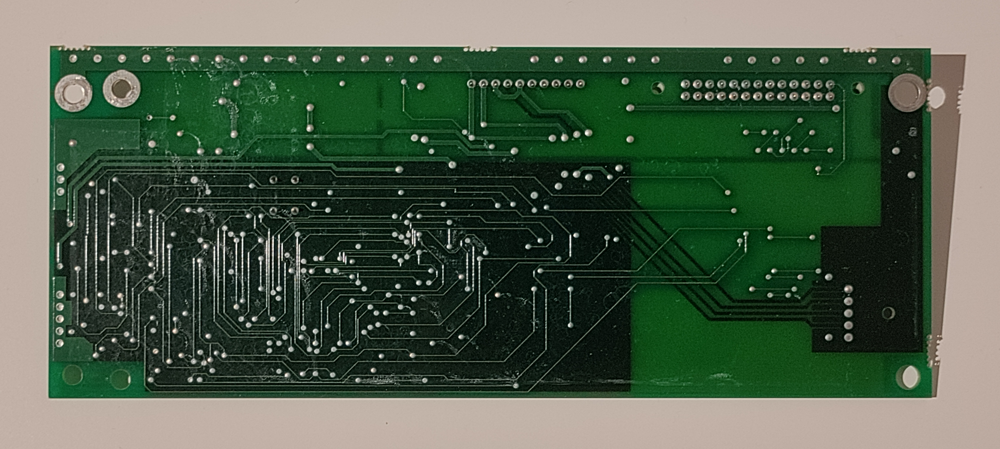

<h1 align="center">Mobitec Flipdot Display</h1>

## Features

## Overview

## MobiPy

The controller of the flipdot display is normally operated by an HMI as described in the Controller chapter. This HMI can now be replaced with the MobiPy software, which instead handles the communication via RS-485. A total of 3 different message types can be sent to the controller. These are distinguished by different hexadecimal values:

- Text in different fonts and sizes
- Different symbols
- Customizable bitmap

### Setup

### Fonts

> not quite right, look in the fonts python file

| Address | Height    | Spacing ()          |        | Size   | Monospaced          | Note                                        |
| ------- | --------- | ------------------- | ------ | ------ | ------------------- | ------------------------------------------- |
| 0x61    | 13px      | Wide                | Normal | Normal | No                  |                                             |
| 0x62    | 9px       | Wide                | Normal | Normal | No                  |                                             |
| 0x63    | 19px      |                     |        |        |                     |                                             |
| 0x64    | 7px       | Wide                |        |        |                     |                                             |
| 0x65    | 7px       | Medium              |        |        |                     |                                             |
| 0x66    | 6px       | -                   |        |        |                     |                                             |
| 0x67    | -         |                     |        |        |                     | Symbols                                     |
| 0x68    | 16px      |                     |        |        |                     | Gg not in line                              |
| 0x69    | 13px      | Medium              |        |        | No                  |                                             |
| 0x6A    | 20 / 16px |                     |        |        |                     | No lowercase, numbers 20px and letters 16px |
| 0x6B    | 20px?     |                     |        |        |                     | No lowercase                                |
| 0x6C    | 12px      |                     |        |        |                     | Only numbers                                |
| 0x6D    | 7px       | Small               |        |        |                     | Only uppercase                              |
| 0x6E    | 16px      |                     |        |        |                     | Only uppercase A, B and numbers             |
| 0x6F    | 14px      |                     |        |        |                     | Only numbers                                |
| 0x70    | 9px       | Medium              |        |        | Yes                 | No lowercase                                |
| 0x71    | 15px      |                     |        |        |                     |                                             |
| 0x72    | 5px       | -                   |        |        |                     |                                             |
| 0x73    | 13px      | Smaller then Medium |        |        | Yes, except numbers |                                             |
| 0x74    | 16px      |                     |        |        |                     | Only Numbers                                |
| 0x75    | 9px       | Small               |        |        | Yes                 | No lowercase                                |
| 0x76    | 15px      | Wide                |        |        |                     |                                             |
| 0x77    | -         |                     |        |        |                     | Bitmap                                      |
| 0x78    | 16px      |                     |        |        |                     | Upper/lowercase different hight             |
| 0x79    | 13px      |                     |        |        | Kinda               | Only numbers                                |


## MobiController


## Controller




### General


### Ports

The board has a 10 and a 26 pin port.  
The 10-pin port is used to connect the HMI to the controller board. The HMI is operated by the bus driver, who controls what the flipdot displays show. Data between the HMI and the controller board is transmitted via [RS-485](https://en.wikipedia.org/wiki/RS-485). Power is as well provide via the HMI. The original cable *KABELUTSTICK* with article number *CE311007.1* is used for the connection. The female 10 pin connector is of type JST-XH-9S1P with a pin spacing of one inch, which corresponds to the spacing of standard pin header connectors. Please note that although the original cable has two different wires soldered to the two GND pins of the plug, only pin 3 is connected to GND on the other end of the plug.  Pin number 5 therefore has no useful functionality. The male connector at the other end of the cable is a proprietary one with unusual notches.


| Pin  | Function       |
| ---- | -------------- |
| 1    | Data -         |
| 2    | Data +         |
| 3    | GND            |
| 4    | VCC 12-24V     |
| 5    | GND (Not used) |
| 6-10 | Not used       |

 


```
Output connector:
	- 26 pin (13 pin x2)
	Pinout (left to right, notch top)
		Top row
			- 11 VCC (24)
			- 12 GND (25)
		Bottom row
			- 24 VCC
			- 25 GND
```


### Interfaces

A button, a rotary selector and a status LED are provided on the board. If the button is pressed once, a test program starts, which outputs various information on the flipdot display. A button, a rotary switch and a status LED are provided on the board. If the button is pressed once, a test program starts, which outputs various information on the flipdot display. The rotary selector can be used to set the address of the board. It has a hexadecimal scale from 0x0 to 0xE. The blink codes of the status LED can be obtained from the following table:

| Sequence (One LED)      | Function                    |
| ----------------------- | --------------------------- |
| Fast blinking           | idle, waiting for a command |
| Powered on, but LED off | Executing a command         |

| Sequence (Two LEDs)       | Function                    |
| ------------------------- | --------------------------- |
| LED1: on, LED2: blinking  | idle, waiting for a command |
| LED1: off, LED2: blinking | Protocol error              |
| LED1: on, LED2: off       | Executing a command         |


## Related projects

- **[flipdot-mobitec (Anton Christensen)](https://github.com/anton-christensen/flipdot-mobitec)**
  - Custom controller based on an ESP32
- **[flipdot](https://github.com/openspaceaarhus/flipdot)**
  - Custom controller based on an ATmega
  - [Protocol description?](https://groups.google.com/g/openspaceaarhus/c/YMDPcS3pnHA) 
  - [Photos / videos](https://www.vagrearg.org/content/dotflipctl)
- **[mobitec-rs485 (duffrohde)](https://github.com/duffrohde/mobitec-rs485)**
  - Basic C RS-485 API
- **[pymobitec-flipdot (Bjarne)](https://github.com/bjarnekvae/pymobitec-flipdot)**
  - Simple Python RS-485 API
- **[mqtt-flipdot-driver (Chalmers Robotics)](https://github.com/ChalmersRobotics/mqtt-flipdot-driver)**
  - Simple Python RS-485 API
- **[maskin-flipdot (Nosen92)](https://github.com/Nosen92/maskin-flipdot)**
  - More advanced Python RS-485 API
- [**elektronikforumet**](https://elektronikforumet.com/forum/viewtopic.php?t=65264)
  - Protocol information
- [**buselektro**](https://www.busselektro.no/tips-og-funksjonsbeskrivelser/mobitec-rs485/)
  - Protocol information