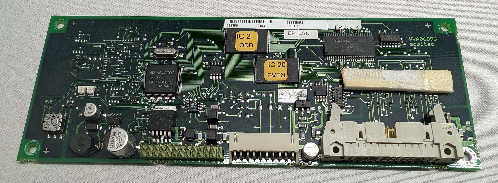
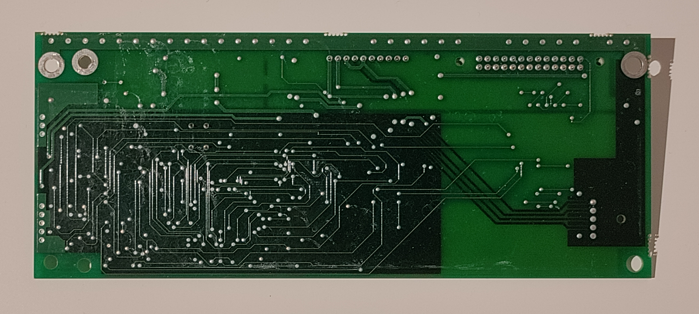
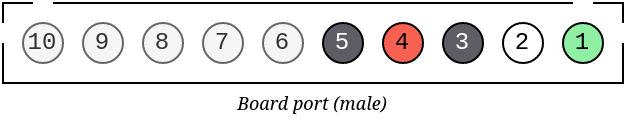
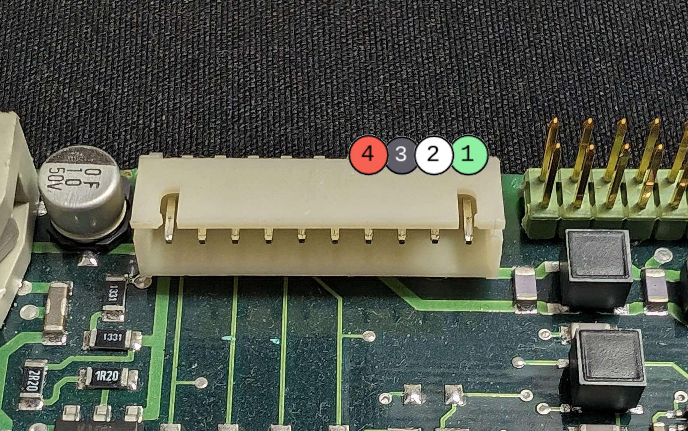

# Controllers

We encountered multiple different controllers. They seem to be functionally the same, even though they are quite different in their appearance. The boards are equal, in that they have a 26 pin port that is connected to the flipdots, and a 10 pin port, that would normally be connected to an HMI (Human Machine Interface), with which the Bus Driver would control what is shown on the display under normal operation. They also have a rotary switch, with which the boards address is selected. They were
located on the left side of the flipdots (where the cable came out of the enclosure), fixed under the flipdot-display with some screws.

One of the boards has a red button, with which a test-program can be started. This board also seems to have a swappable EEPROM (?), which indicates that this might be a development board. This board also has only one LED, while the other one has two. Our guesses of what the LEDs say about the board's status are found in [#leds](#leds).

## Connecting to the Board

Of the ten pins, only four are used. Two of them for power, the other ones for communication via the [RS-485](https://en.wikipedia.org/wiki/RS-485) protocol:

| Pin  | Function       |
|------|----------------|
| 1    | Data -         |
| 2    | Data +         |
| 3    | GND            |
| 4    | VCC 12-24V     |
| 5    | GND (Not used) |
| 6-10 | Not used       |

The Plug seems to be approximately a `JST-XH-9S1P`, but it's also possible to just connect some jumpers to the pins.

However, since taking out the flipdots to get access to the board can be quite a hassle for some of the bigger displays, it's also possible to connect to the round cable that comes out of the flipdot enclosure. It is normally connected to the 10 pin port. It seems to be proprietary, but it's possible to connect to it, even though it's a bit hacky:

The board seems to operate between 12 and 24V. There are also LEDs, placed on the bottom of the case, that illuminate the flipdots from diagonally below and run on 24v. They have their own plug, a simple two pin.

## Board LEDs

We oberved the following patterns of the LEDs:

**Development-Board (One LED)**

| Sequence                | Function                    |
|-------------------------|-----------------------------|
| Fast blinking           | Idle, waiting for a command |
| Powered on, but LED off | Executing a command         |

**Normal Board (Two LEDs)**

| Sequence (Two LEDs)                          | Function                    |
|----------------------------------------------|-----------------------------|
| LED1: on, LED2: blinking                     | Idle, waiting for a command |
| LED1: off, LED2: blinking                    | Error with last message     |
| LED1: on, LED2: not blinking (static on/off) | Executing a command         |

## Capabilities and Limitations

The boards are controlled via RS-485 and a protocol, which is quite well known, due to previous work done by the community (see [protocol.md](protocol.md) for details). Talking to the flipdots over the controller via this protocol is simple, effective and accessible, because very little additional hardware is required (namely just a RS-485 adapter, like [this one](https://www.berrybase.de/en/usb-rs485-konverter)), which is why we deciced to keep the controllers in place for now. There have also
been efforts to
replace the controller, namely [anton-christensen/flipdot-mobitec](https://github.com/anton-christensen/flipdot-mobitec) (esp32-based controller) and [openspaceaarhus/flipdot](https://github.com/openspaceaarhus/flipdot) (atmega-based full replacement).

This repository contains a simple python script, mostly taken from [Nosen92/maskin-flipdot](https://github.com/Nosen92/maskin-flipdot), which is a little bit messy, but works, and a golang-based implementation, which aims to provide a more powerful API for controlling the flipdots. They can both be found in the [src-Directory](../src/).

The boards contain pre-defined fonts and symbols, which can be easily displayed. A list of fonts that is correct and tested for our variations of boards can be found in [fonts.md](fonts.md). Since basically every project we found had a different list of fonts, we assume that the fonts may not be the same for every board (alternatively, people just made some mistakes). The fonts and their implementation by the contollers themselves are quite strange, with most of the fonts having some drawbacks.

Alternatively, a bitmap can be used to control the individual pixels. For this, the board has its own protocol.

One drawback of the controller is its speed. On power on, it can take 5-15 seconds for the board to be ready for commands. In addition, the processing is very slow aswell. No matter how much data is actually sent to the board, it takes 1-2 seconds for it to process. If a full bitmap matrix is sent, all dots are energized, regardless of whether they changed or not. This can be sped up, by managing the dots state in software and only sending small matrices to the board, but even when only one
column (1x16) is set at a time, the board struggles to reach 1 fps, executing 2-3 packets in quick succession and then lagging for over a full second. This means that the controller is not suitable for animations of any kind. This [seems to be](https://www.youtube.com/watch?v=opCHlJ_8fGk) a controller problem, not a flipdot one.